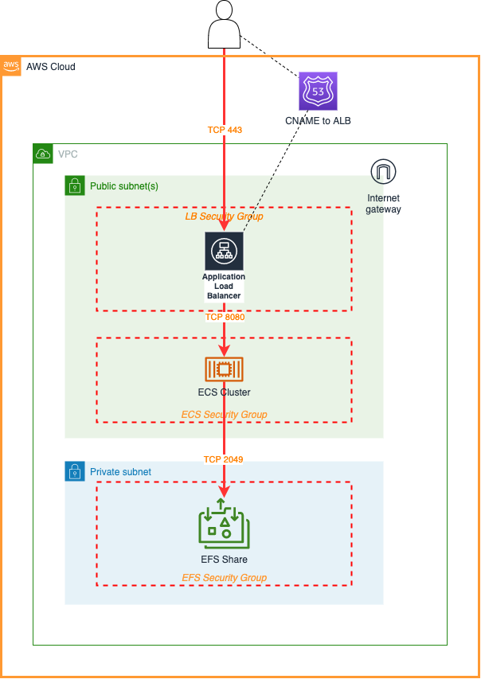

# ECS Deployment of Jenkins

- [ECS Deployment of Jenkins](#ecs-deployment-of-jenkins)
  - [Overview](#overview)
  - [Architecture Diagram](#architecture-diagram)
  - [Pre-requisites](#pre-requisites)
  - [Optional configuration](#optional-configuration)

## Overview
This project deploys a stack into an AWS account via CloudFormation - see [template.yml](./template.yml)

## Architecture Diagram

## Pre-requisites
* VPC with at least two public subnets and two private subnets
* Certificate held with Amazon Certificate Manager

## Optional configuration
* Creation of entry in Route53 to provide 'friendly' URL to load balancer (requires Route53 Hosted Zone)
* Working hours scale-out/scale-in

